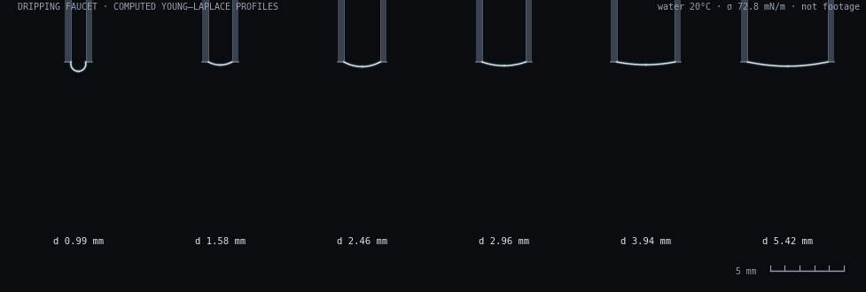

# Research-Dripping-Faucet-Model

An analytical answer to a question everyone can ask at a kitchen sink:
**at exactly what volume does a hanging drop let go?**

*Scientific Journal of Intelligent Systems Research* · Vol. 8, No. 3 · 2026 · pp. 118–130
DOI [10.54691/28yasx98](https://doi.org/10.54691/28yasx98) · AMME 2025 (8th Int'l Conference on Advances in Materials, Machinery, Electronics)
ISBN 979-8-89183-215-2 · Boya Century Publishing · sole author · advisor: Dr. Xiaoqin Feng

Grew out of three seasons of Young Physicists' Tournament work:
CYPT 2026 — tournament champion & Special Prize · CYPT 2025 — Special Prize
IYPT China national training team, 2025 and 2026



*Six nozzle bores, one governing equation. These are computed Young–Laplace
profiles (water, 20 °C), not camera footage — the bench data is in the
table below.*

**[▶ Watch it let go — interactive](https://jerryxugit-2026.github.io/Research-Dripping-Faucet-Model/)**

---

## The question

A drop hangs from a tap, grows, and at some point falls. Everyone knows
this. Almost nobody can tell you the exact volume at which it lets go —
the standard way to find out is to integrate the surface equation
numerically, which is slow and gives you a number instead of a formula.

I wanted a formula.

## What I did

**Theory.** The shape of a hanging drop is governed by the Young–Laplace
equation. At small Bond number (surface tension dominating gravity) I
expanded it perturbatively and got closed-form expressions for the drop's
profile and volume. For the moment of letting go, I used a convexity
argument: the equation behaves as a convex function of the drop's
curvature, so the critical solution is not just found — it is provably
the *only* one.

**Experiment.** I built the rig myself: a programmed syringe pusher
(0.01–3.0 mm/s, microcontroller-driven) feeding six thin-walled nozzles of
inner diameters 0.99–5.42 mm, filmed at 815 fps. Volumes were extracted
from the detachment frames in Fiji, then computed with a Python script.
Ten drops per nozzle for the critical-volume test — though over the
project's life the rig, running semi-automatically, has logged more than
80,000 drop intervals for the dynamics side of the problem.

## Results

Quoted from Table 2 of the paper:

| Nozzle | d (mm) | Theory (µl) | Measured (µl) | Exp. error | Theory vs. exp. |
|---|---|---|---|---|---|
| 1 | 0.99 | 4.7 | 4.55 | 1.36% | 3.2% |
| 2 | 1.58 | 8.1 | 7.59 | 1.41% | 6.2% |
| 3 | 2.46 | 14.2 | 12.46 | 0.19% | 12% |
| 4 | 2.96 | 40.1 | 38.57 | 4.24% | 3.8% |
| 5 | 3.94 | 47.2 | 50.96 | 1.58% | 7.3% |
| 6 | 5.42 | 53.1 | 54.3 | 1.34% | 2% |

Two findings beyond the table: the critical volume grows with nozzle
radius and Bond number — and it is **independent of the liquid's intrinsic
contact angle**. However the drop starts, the contact angle at the rim
evolves toward 90° as it grows; where it lets go doesn't remember where it
began. You can drag that slider yourself in the
[interactive version](https://jerryxugit-2026.github.io/Research-Dripping-Faucet-Model/).

## What's in this repo

```
docs/     the interactive demo (GitHub Pages)
assets/   figures — all drop profiles are computed, and labeled as such
data/     ten drops × six nozzles, raw measurements     [being prepared]
analysis/ Fiji → Python volume-extraction pipeline      [being prepared]
rig/      microcontroller code for the syringe pusher   [being prepared]
photos/   the rig, the nozzles, detachment frame series [being prepared]
```

## What this doesn't show

- The 815 fps camera can still straddle the exact detachment instant; the
  rig occasionally vibrates; the nozzle mouth is never perfectly
  horizontal. These are the main error sources discussed in the paper.
- The theory is a small-Bond-number expansion. The largest nozzle here has
  the largest Bond number, and that is where a perturbation method is
  least at home.
- The demo and the GIF integrate the full Young–Laplace equation
  numerically — they are companion visualizations of the same physics,
  **not** a reproduction of the paper's perturbation calculation or of
  Table 2.
- Quasi-static means slow. At higher flow rates the dripping interval
  period-doubles into chaos — a classical story, and deliberately not this
  paper's.

## The paper

> Xu, Ziyang. 2026. "Analytical Analysis of a Dripping Faucet Model Based
> on the Perturbation Method." *Scientific Journal of Intelligent Systems
> Research* 8 (3): 118–30. https://doi.org/10.54691/28yasx98.
> AMME 2025 · ISBN 979-8-89183-215-2.

Full text: [bcpublication.org/index.php/SJISR/article/view/9299](https://bcpublication.org/index.php/SJISR/article/view/9299)

---

*One of four directions on [my profile](https://github.com/jerryxugit-2026) —
physics, art history, AI tooling, and public systems.*
